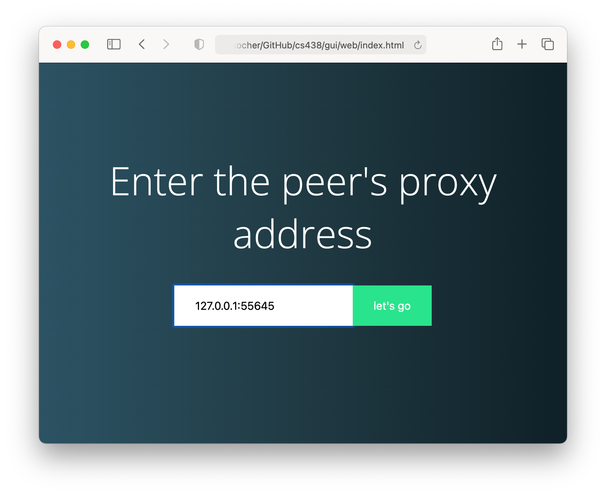
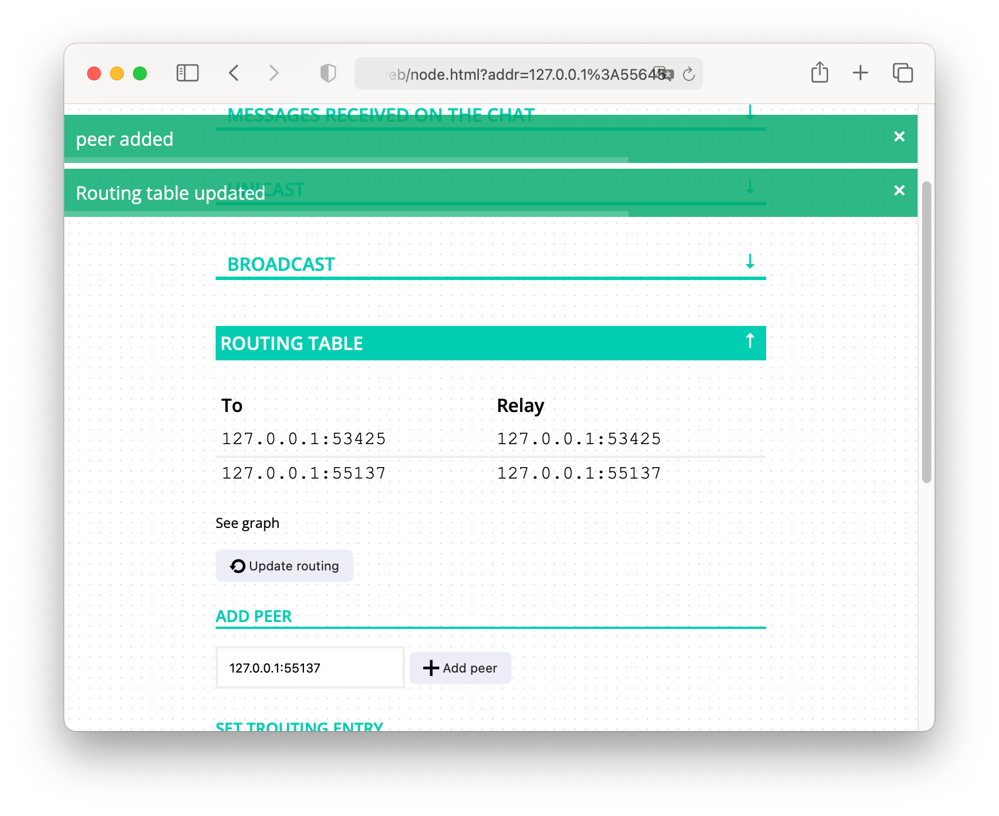
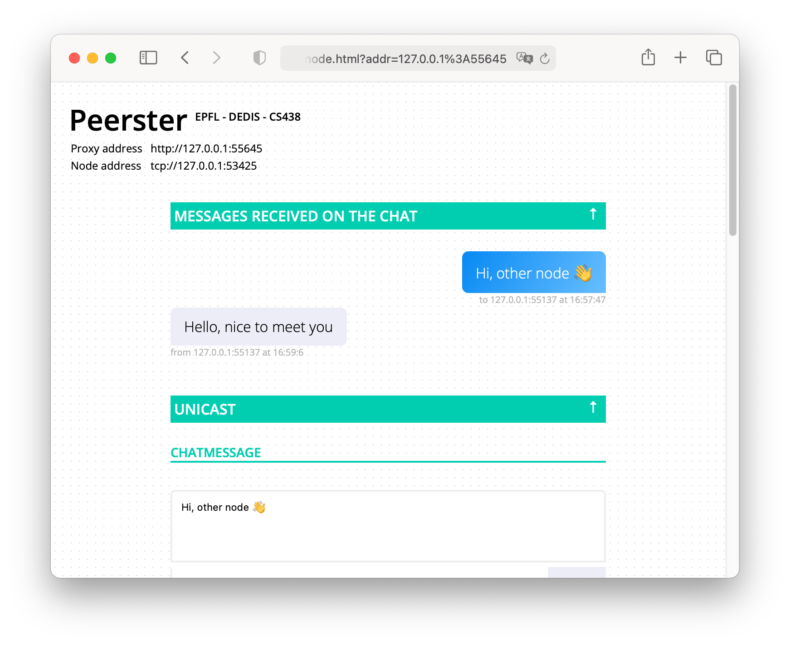

# CS438

Homework material for the "Decentralized System Engineering" course.

Provided by the DEDIS lab at EPFL.

## Run the tests

See commands in the Makefile. For example: `make` will build all tests (equivalent to `make all`).

## Quick setup

Install go = 1.23.

Run a node:

```sh
cd gui
go run gui.go start
```

Then open the web GUI page `gui/web/index.html` and enter the peer's proxy
address provided by the peer's log: `proxy server is ready to handle requests at
'127.0.0.1:xxxx'`. You can run as many peers as wanted and connect them together
using the "routing table" > "add peer" section in the WEB GUI.

## Screenshots

1. Connect to a peer's proxy



2. Add a peer



3. Exchange chat messages


